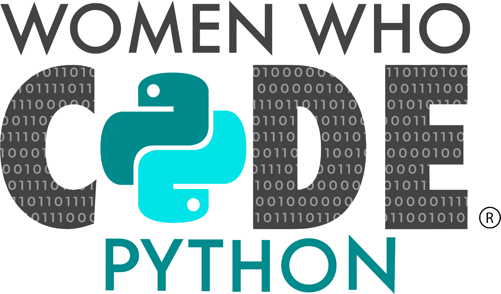

 

<h1>&nbsp;ML Mondays with WWCodePython</h1>

   

&nbsp;

<table style="border: none;">
  <tr style="border: none;">
    <th style="border: none;"> </th>
    <td width="60%" align="left" style="border: none;">
<h1>Jupyter Notebooks, Data, Resources & Homework </h1>

 

 	
 
    

    
 

 
 

 

    

    

 
  

 

</td>
  </tr>
</table>

