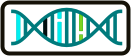
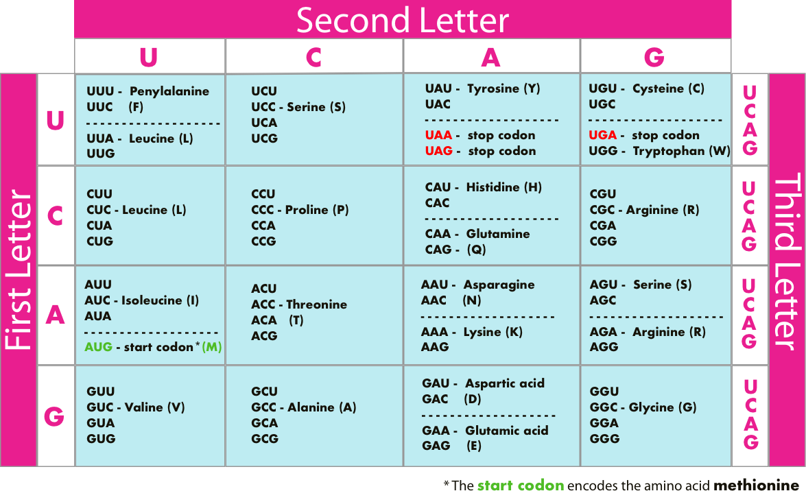

<h1>&nbsp; Making a Protein from DNA</h1>

 

 

_This exercise can be solved in _**many**_ different ways. It's designed to  get you familiar with the basic elements of Python listed below & doesn't require anything "advanced" (unless, of course you'd like to play with more advanced features.) -- everything you need to solve this challenge is included in core Python._

 

* [**opening & processing files**](https://docs.python.org/3/tutorial/inputoutput.html#reading-and-writing-files)
* [**joins**](https://docs.python.org/3/library/stdtypes.html#str.join) on strings & [**string substitution**](https://docs.python.org/3/library/stdtypes.html#str.maketrans)
* [**string replacement**](https://docs.python.org/3/library/stdtypes.html#str.replace) & string [**find**](https://docs.python.org/3/library/stdtypes.html#str.find)
* [**dictionaries**](https://docs.python.org/3/library/stdtypes.html#mapping-types-dict) or other dictionary-like structures
* the [**modulo operator**](https://docs.python.org/3/reference/expressions.html?highlight=modulo#binary-arithmetic-operations)
* string [**indexing & slicing**](https://docs.python.org/3/tutorial/introduction.html?highlight=string%20slicing#strings)
* writing test cases in [**unittest**](https://docs.python.org/3/library/unittest.html?highlight=unittest#module-unittest) or [**doctest**](https://docs.python.org/3/library/doctest.html?highlight=unittest) (_if you chose to go that route_)

 

**Optionally, you could use:**
* [**regex**](https://www.rexegg.com/regex-quickstart.html) or [**re**](https://docs.python.org/3/library/re.html?highlight=re#module-re)
* [**string**](https://docs.python.org/3/library/stdtypes.html#text-sequence-type-str) (_in particular, **`str.maketrans`** & **`str.translate`**_)
*  [**collections**](https://docs.python.org/3/library/collections.html)
*  [**itertools**](https://docs.python.org/3.1/library/itertools.html) or  [**functools**](https://docs.python.org/3.6/library/functools.html) modules
* [**numpy**](http://www.numpy.org/) or [**pandas**](https://pandas.pydata.org/) libraries
* [**error handling**](https://docs.python.org/3/tutorial/errors.html?highlight=error%20handling)
* [**biopython**](http://biopython.org/) or [**libnano**](https://github.com/libnano/libnano) - _for the really inspired_

 

## Challenge Background

 

_Below we've given you a backstory, but you may not need all of the detail.  Refer back here as needed for your understanding._

 

    

       
    

 

 

_Here is a great [**video**](https://www.khanacademy.org/science/biology/gene-expression-central-dogma/modal/v/rna-transcription-and-translation) from Kahn Academy, if reading the description doesn't work well for you._

 

Life depends on the ability of cells to store, retrieve, and translate genetic instruction.
These genetic instructions are expressed in organisms via _**Proteins**_.

For a long time it wasn't clear to scientists which molecules were able to copy & transmit genetic information, or how the process worked. Today, thanks to _**`James Watson`**, **`Francis Crick`**, **`Rosalind Franklin`**, & **`Maurice Wilkins`**_ -- among many others --
we know this genetic information is carried by [**dioxyribonucleic acid or DNA**](https://ghr.nlm.nih.gov/primer/basics/dna), & transmitted via [**mRNA**](https://www.genome.gov/genetics-glossary/messenger-rna).

DNA is a [**double helix**](https://www.nature.com/scitable/definition/double-helix-277/) -- but for the purpose of this exercise it's easiest to visualize it as a one dimensional string of 4 repeating characters: **A, C, G, & T**.  These 4 **bases** represent the first letters of the four [_**nucleotides**_](https://www.genome.gov/genetics-glossary/Nucleotide) that make up DNA: _adenine_ (**A**), _cytosine_ (**C**), _guanine_ (**G**), and _thymine_ (**T**).

Prior to forming proteins, information in DNA is transferred to a _messenger RNA_ (**mRNA**) molecule in a process called [**transcription**](https://www.khanacademy.org/science/biology/gene-expression-central-dogma/transcription-of-dna-into-rna/a/overview-of-transcription). The resulting mRNA is a single-stranded copy of a gene from the source DNA.

This mRNA is then [**translated**](https://www.khanacademy.org/science/biology/gene-expression-central-dogma/translation-polypeptides/a/translation-overview) according to the [**genetic code**](https://openstax.org/books/biology-2e/pages/15-1-the-genetic-code).  The  **_genetic code_** maps a **DNA/mRNA** sequence into an **amino acid sequence** for a protein.

 

    

    
    

 

 

<h2 align="center">The Genetic Code</h2>

  
  

 

 

 

  <table width= "100%" align="center">
  <thead>
  <tr>
  <th colspan="5"><h3 align="center">Amino Acids &amp; Their One-Letter Codes</h3></th>
  </tr>
  <tr>
  <th><strong><h4>A-E</h4></strong></th>
  <th><strong><h4>F-K</h4></strong></th>
  <th><strong><h4>L-Q</h4></strong></th>
  <th><strong><h4>R-V</h4></strong></th>
  <th><strong><h4>W-Z</h4></strong></th>
  </tr>
  </thead>
  <tbody>
  <tr>
  <td align="center"><h2>A</h2>Alanine</td>
  <td align="center"><h2>F</h2>Phenylalanine</td>
  <td align="center"><h2>L</h2>Leucine</td>
  <td align="center"><h2>R</h2>Arginine</td>
  <td align="center"><h2>W</h2>Tryptophan</td>
  </tr>
  <tr>
  <td align="center"><h2>B</h2>Asx</td>
  <td align="center"><h2>G</h2>Glycine</td>
  <td align="center"><h2><strong>M</h2>Methionine</strong></td>
  <td align="center"><h2>S</h2>Serine</td>
  <td align="center"><h2>X</h2>Xaa -- <h8><em>any</em>  Anmino Acid</h8></td>
  </tr>
  <tr>
  <td align="center"><h2>C</h2>Cysteine</td>
  <td align="center"><h2>H</h2>Histidine</td>
  <td align="center"><h2>N</h2>Asparagine</td>
  <td align="center"><h2>T</h2>Threonine</td>
  <td align="center"><h2>Y</h2>Tyrosine</td>
  </tr>
  <tr>
  <td align="center"><h2>D</h2>Aspartic Acid</td>
  <td align="center"><h2>I</h2>Isoleucine</td>
  <td align="center"><h2>P</h2>Proline</td>
  <td align="center"><h2>U</h2>Selenocysteine</td>
  <td align="center"><h2>Z</h2>Glutamic Acid/Glutamine</td>
  </tr>
  <tr>
  <td align="center"><h2>E</h2>Glutamic Acid</td>
  <td align="center"><h2>K</h2>Lysine</td>
  <td align="center"><h2>Q</h2>Glutamine</td>
  <td align="center"><h2>V</h2>Valine</td>
  <td></td>
  </tr>
  </tbody>
  </table>
 <em><b>Note:</b> U, X, and Z do not apply for this exercise</em>
 

 

 

 

 Each group of _**nucleotide triplets**_ (called a **codon**) in the mRNA correspond to a specific amino acid. The **mRNA codon** sequence is used as a template to assemble-in-order (via [**tRNA**](https://www.nature.com/scitable/definition/trna-transfer-rna-256/)), a chain of amino acids -- which then form a protein (see [**this article**](https://www.nature.com/scitable/topicpage/translation-dna-to-mrna-to-protein-393) for more specific detail).

Protein assembly starts with the _**start codon**_ (**AUG**), & proceeds down the mRNA sequence until a _**stop codon**_ is reached.

Every protein has a unique amino acid sequence built in a similar process from the same base set of 20 amino acids arranged in different orders. These amino acids & their manufacture is common to all living things on Earth. In a very real sense, DNA, mRNA, & these codons form a _**dictionary of life**_.

 

*  [Detail on DNA -> Protein Expression](https://www.nature.com/scitable/topicpage/translation-dna-to-mrna-to-protein-393)
*  [Detail on Reading the Genetic Code](https://www.nature.com/scitable/topicpage/Reading-the-Genetic-Code-1042)
*  [History and Theory of the Genetic Code](https://www.ncbi.nlm.nih.gov/pmc/articles/PMC3293468/)
*  [NCBI](https://www.ncbi.nlm.nih.gov/)

 

 

 

## What Do You Need To Code?

 

You're going to write code that goes through a _**nucleotide**_ from [**NCBI**](https://www.ncbi.nlm.nih.gov/) & makes an amino acid sequence (eg. **Protein**) via _**transcription**_, _**processing**_, & _**translation**_.  This is going to have three steps:

1) **Transcripting** the DNA to mRNA,
2) **Processing** the mRNA into codons (and finding the start & stop codons)
3) **Translating** the codons into an amino acid chain.

You should then verify the results with the provided mRNA & amino acid information from **NCBI**.

 

## Detailing the Steps

<h4>&nbsp; <em>Translate</em> DNA into mRNA</h4>

 

Both DNA and mRNA strands are a **_sequence of nucleotides_**.

The four nucleotides found in DNA
*  adenine (**A**)
* cytosine (**C**)
* guanine (**G**)
* thymine (**T**).

The four nucleotides found in RNA
* adenine (**A**)
* cytosine (**C**)
* guanine (**G**)
* uracil (**U**)

An **_mRNA_** strand is formed by **replacing** each DNA nucleotide with its mRNA complement.

**G** --_maps to_--> **C**

**C** --_maps to_--> **G**

**T** --_maps to_--> **A**

**A** --_maps to_--> **U**

_What are the different ways you can take the input strand & produce the desired output?_

_How do you read/verify your input, & store your output?_

 

<h4>&nbsp; <em>Process</em> the mRNA into <em>codons</em></h4>

 

An mRNA strand is processed in _**units of 3**_, starting from the left-hand end. _Nucleotide triplets_ or _triplet bases_ are formed using a **moving window or frame** (e.g. 0123456789 turns into **012**, **345**, **678**) beginning with a _start codon_ (AUG), and proceeding until a stop codon is reached.

**example:** 'UAG UGC ACC AGA AUU UGA' **_becomes_** UAG UGC ACC AGA AUU (_UGA is a **stop codon**_)

_Think about how you would look for the start codon.  What tecniques could you use?  Once you find the start, how do you navigate the rest of the strand?  What strategies can you use to form the codons?  What data structure will you use to store them?  How will you verify that you've produced the codons correctly?_

 

<h4>&nbsp; <em>Translate</em> mRNA into an <em>Amino Acid Chain</em></h4>

 

_**mRNA codons**_ are translated according to :

    

    <h3>&nbsp; The Genetic Code 
    

 

<h2 align="center">The Genetic Code</h2>

  
  

 

 

 

  <table width= "100%" align="center">
  <thead>
  <tr>
  <th colspan="5"><h3 align="center">Amino Acids &amp; Their One-Letter Codes</h3></th>
  </tr>
  <tr>
  <th><strong><h4>A-E</h4></strong></th>
  <th><strong><h4>F-K</h4></strong></th>
  <th><strong><h4>L-Q</h4></strong></th>
  <th><strong><h4>R-V</h4></strong></th>
  <th><strong><h4>W-Z</h4></strong></th>
  </tr>
  </thead>
  <tbody>
  <tr>
  <td align="center"><h2>A</h2>Alanine</td>
  <td align="center"><h2>F</h2>Phenylalanine</td>
  <td align="center"><h2>L</h2>Leucine</td>
  <td align="center"><h2>R</h2>Arginine</td>
  <td align="center"><h2>W</h2>Tryptophan</td>
  </tr>
  <tr>
  <td align="center"><h2>B</h2>Asx</td>
  <td align="center"><h2>G</h2>Glycine</td>
  <td align="center"><h2><strong>M</h2>Methionine</strong></td>
  <td align="center"><h2>S</h2>Serine</td>
  <td align="center"><h2>X</h2>Xaa -- <h8><em>any</em>  Anmino Acid</h8></td>
  </tr>
  <tr>
  <td align="center"><h2>C</h2>Cysteine</td>
  <td align="center"><h2>H</h2>Histidine</td>
  <td align="center"><h2>N</h2>Asparagine</td>
  <td align="center"><h2>T</h2>Threonine</td>
  <td align="center"><h2>Y</h2>Tyrosine</td>
  </tr>
  <tr>
  <td align="center"><h2>D</h2>Aspartic Acid</td>
  <td align="center"><h2>I</h2>Isoleucine</td>
  <td align="center"><h2>P</h2>Proline</td>
  <td align="center"><h2>U</h2>Selenocysteine</td>
  <td align="center"><h2>Z</h2>Glutamic Acid/Glutamine</td>
  </tr>
  <tr>
  <td align="center"><h2>E</h2>Glutamic Acid</td>
  <td align="center"><h2>K</h2>Lysine</td>
  <td align="center"><h2>Q</h2>Glutamine</td>
  <td align="center"><h2>V</h2>Valine</td>
  <td></td>
  </tr>
  </tbody>
  </table>
 <em><b>Note:</b> U, X, and Z do not apply for this exercise</em>
 

 

 

_What kind of data structure can you use to represent the Genetic Code? How do you translate or map your codons to it?  What data structure will you use to store output?  How will you verify that you have a correct result?_

Once the mapping is complete, we have an amino acid chain!

 

 

## Files

_We've given you some data files and Python boilerplate code to start off with.  These files can be downloaded from GitHub [**here**](./../RNA-Transcription/starter_files)_.

 

<h4>&nbsp; &nbsp; Input Data</h4>

  *   DNA nucleotide from NCBI (the file called **_dna.txt_**)

 

   
  
  
<h4>&nbsp; Verification Data</h4>

* mRNA sequence (**_mrna.txt_**)
* amino acid sequence from NCBI (**_protein.txt_**)

 

 

<h4>&nbsp; Code Skeleton</h4>

* **Assignment.py** --  _starter code_
* **process.pyc** --   _helper method for codons if you get stuck_
* **translate.pyc** -- _helper method for translation if you get stuck_

 

 

<h4>&nbsp; Testing</h4>

 

While testing it isn't _required_ ...you may want to take some time to write a few lightweight tests, either with [**unittest**](https://docs.python.org/3/library/unittest.html), or [**doctest**](https://docs.python.org/3/library/doctest.html).

If you decide to use  [**unittest**](https://docs.python.org/3/library/unittest.html),  we've given you three skeletons to flesh out as you work through the exercise.

To run tests from the command line, navigate to the exercises root directory and (for example) run the `python rna_transcription_test.py` command.

 

* **rna_transcription_test.py**
* **rna_processing_test.py**
* **protein_translation_test.py**

 

## Refactoring

 

_Once your foundation code works & is tested, you might want to consider the following questions & refactor your code:_

 

* Have you written enough tests to be sure you've covered all your bases?
* Have you documented the code sufficiently?
* Have you effectively separated the functions & 'concerns' of your program?
* Have you written abstract & generalizable code - or did you code to make your specific tests pass?
* What if your input isn't valid DNA?  Do you reject it, or can you clean it?
* Could one or more **modules** (itertools, functools, re, collections) or **libraries** (numpy, pandas, biopython, libano)     help you solve this problem in a different or faster way?
* What if your input is *really big* does that change how you go about processing it?
* Do you write to a file or print to the screen?
* Are there other factors you need to consider?

 

## Additional Challenge

 

_If you've stuck with us this far, & find yourself wanting even **moar** practice..... here's some additions or extensions you might consider._

 

*  How many **_other_** ways could this problem be solved?

* What other skills/strategies in Python could you practice?

* If you've used loops in your code, are there strategies you could use to **_eliminate_** them?

* Could you combine the making of the codons with the translation to amino acids?  Would you _**want**_ to do that?

* Could you do the reverse:  write code to take a _**protein**_ & produce a _**DNA sequence**_?

* Could you turn this into a simple command-line tool for a less programming-minded person?

* What strategies could you use to translate more than one Gene at a time?
   *  Take a look at [NCBI NC_000077.6: C57BL/6JChromosome 11](https://www.ncbi.nlm.nih.gov/nuccore/NC_000077.6?report=fasta&from=69580359&to=69591873) - saved as full_mouse.txt. Could you adapt your code to account for multiple genes, multiple starts/stops, & multiple proteins?

* How would you adapt the test suite to account for multiple genes, multiple starts/stops, and multiple proteins?

* Rather than download every DNA sequence manually, could you devise a strategy to do it automatically through some sort of [**API**](https://www.ncbi.nlm.nih.gov/pmc/tools/developers/)?

* What strategies could you use to automatically validate your results with NCBI?
   * Does NCBI have a [**public APIs**](https://www.ncbi.nlm.nih.gov/pmc/tools/developers/) or other means to programmatically check or query their data? _**Note:** NCBI shows mRNA as complimentary DNA, so all **U**s are **T**s in their DB_

 

 

#### Assignment inspiration & thanks to

*  Kshitij Chawla [GitHub](https://github.com/kchawla-pi) **|** [LinkedIn](https://www.linkedin.com/in/kchawla-pi)
*  [Exercism.io](http://exercism.io/)
*  [Rosalind](http://rosalind.info/problems/rna)   **|**   [HarvardX: PH526x Using Python for Research](https://courses.edx.org/courses/course-v1:HarvardX+PH526x+3T2016)
