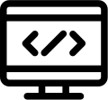
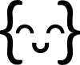

 

<h1>&nbsp; Whirlwind Python Tour Homework</h1>

 

 

 

 

<a href="./RNA-Transcription/README.md"><h1>&nbsp; Making a Protein from DNA</h1></a>

 

 

We're going to practice with something Python does really well:  processing & parsing --- by building a little program that makes a protein from DNA.  

While the data you end up working with in your ML projects might not be strings of DNA or RNA, this coding challenge will give you some good challenges with a common _pre processing_ task for many data sets -- cleaning, munging, and transforming various types of text.

But if this  just _isn't for you_ -- you can always get your Python practice below through exercism.io instead.  Or even supplement this homework with exercism.io.

 

 

 

<h1>&nbsp; Exercising on Exercism.io</h1>

 

 

For enven more practice, go to exercism.io  (_you can use GitHub to login_), and work your way through the first 5 or so exercises.  You'll get some good practice in basic Python, have some automated tests of your code .... and get valuable feedback from volunteer mentors.  It's really a great place to learn...and who knows?  You might want to buckle down and do _**even more exercises**_ when you're through.

 
